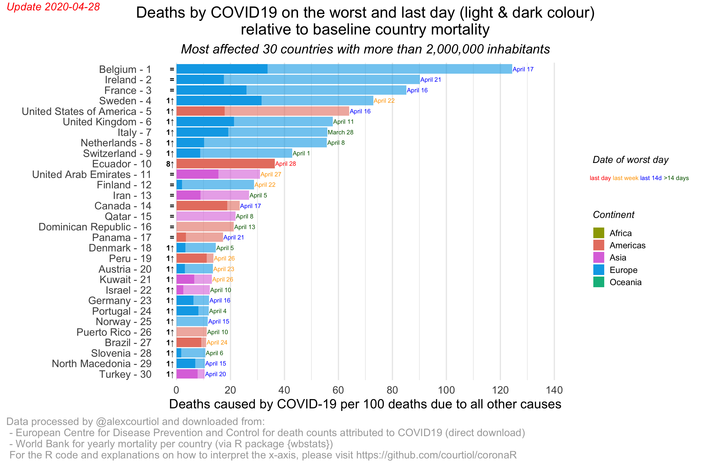
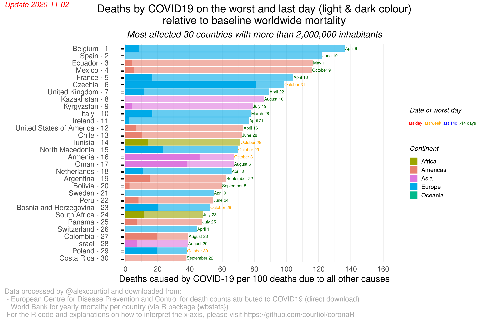

<!-- README.md is generated from README.Rmd. Please edit that file -->

# coronaR

The motivation for such an R package and the plots it produces is that
most people don’t know if X deaths caused by something is a lot or not.
Indeed, unless you are a demographer, you probably have no idea how many
people die in the world or even in your city, over a year, or over a
day. (If you want to know, a good rule of thumb is that over a given
year, in a “rich” country, you can expect roughly 1% of its whole
population to die.)

## General tips for interpreting the plots

### How to read the x-axis?

Here I express the number of *reported* COVID19 deaths compared to 100
“normal” deaths.

For example, a value of 50 would imply that if 100 normal deaths used to
occur in a city, then we would observe 150 deaths in total (100 normal +
50 COVID19 ones) assuming that normal deaths have not changed.

This is more informative than expressing the result as a percentage: if
the COVID deaths reach very large numbers, we will still see on this
graph such an increase progressing linearly. Instead, expressed as a
percentage, the death toll would just slowly converge towards 100%.

If you still want to express such number as a percentage, just do:

If you still want to express such number as a percentage, just do `100 *
X/(100 + X)`. For example, with 50 COVID death per 100 normal ones, the
percentage of COVID death is thus 100 \* 50/150 = 33.333%.

If instead you want to instead express values along the x-axis as the
odd of dying from COVID, just divide the value X you read on the axis by
100: `(X / (100 + X))/(100 / (100 + X)) = X/100`. For example, with 50
COVID death per 100 normal ones, the odd of COVID death is thus 50/100 =
0.5.

### Daily vs cumulative deaths

The package allows to explore or plot either daily deaths or cumulated
deaths since a given country had reached a total of 10 deaths. Daily
deaths are susceptible to vary due to lags in reporting alone. For this
reason, I try to discount the lump reports from nursing homes when they
correspond to several days, but I cannot keep track of all of them.

Cumulative deaths are thus probably better since when the deaths are
being reported matters less.

### Baseline

When deaths are counted on a daily basis, the baseline is also computed
on a daily basis.

When deaths are cumulated, the baseline is computed using normal
mortality that would have occurred during the period between the date
when the country reached 10 cumulative total deaths and the date of the
report being analysed.

To count normal deaths and produce a baseline, the package allows you to
either use the most recent mortality data for the same country that is
analysed (2018), or to use the average mortality data from the entire
world (which is much higher than the country level one in the healthier
countries). The choice of the baseline impacts on the ranking.

### Why on Earth can cumulative mortality go down?

It is because the cumulative deaths are expressed relatively to the
baseline mortality that occurs during the same period. Therefore, if the
deaths caused by COVID19 pile up more slowly that the normal deaths,
then the relative measure shown in the plot can go down.

## Package installation

You can install this package using **{remotes}** (or **{devtools}**):

``` r
remotes::install_github("courtiol/coronaR")
```

## Basic usage of the package

### Load the package {coronaR}

``` r
library(coronaR)
```

### Create the data with the COVID mortality information

``` r
today <- Sys.Date() ## note: you can change the date, to rebuild plots retrospectively
data_COVID <- prepare_data_ECDC(path_save_data = "~/Downloads/COVID19",
                                date_of_report = today)
#> The source of the COVID data have been stored in~/Downloads/COVID19/COVID-19-geographic-disbtribution-worldwide-2020-05-10.xlsx!
#> Warning in countrycode::countrycode(.data$iso2c, origin = "iso2c", destination = "continent"): Some values were not matched unambiguously: XK
data_COVID
#> # A tibble: 16,663 x 9
#>    country iso2c continent date_report date_report_last cases deaths_daily
#>    <chr>   <chr> <fct>     <date>      <date>           <dbl>        <dbl>
#>  1 Afghan… AF    Asia      2020-05-10  2020-05-10         255            6
#>  2 Afghan… AF    Asia      2020-05-09  2020-05-10         215            3
#>  3 Afghan… AF    Asia      2020-05-08  2020-05-10         171            2
#>  4 Afghan… AF    Asia      2020-05-07  2020-05-10         168            9
#>  5 Afghan… AF    Asia      2020-05-06  2020-05-10         330            5
#>  6 Afghan… AF    Asia      2020-05-05  2020-05-10         190            5
#>  7 Afghan… AF    Asia      2020-05-04  2020-05-10         235           13
#>  8 Afghan… AF    Asia      2020-05-03  2020-05-10         134            4
#>  9 Afghan… AF    Asia      2020-05-02  2020-05-10         164            4
#> 10 Afghan… AF    Asia      2020-05-01  2020-05-10         222            4
#> # … with 16,653 more rows, and 2 more variables: deaths_cumul <dbl>,
#> #   date_first_10_cumul_deaths <date>
  
## NOTE: the following Warning is expected:
#Warning message:                                                                         
#  In countrycode::countrycode(.data$iso2c, origin = "iso2c", destination = "continent") :
#  Some values were not matched unambiguously: XK
```

### Small manual fix for lumped report of deaths

For daily plots, you may want to remove manually lump report of deaths
from nursing homes:

``` r
  data_COVID[data_COVID$country == "France" & data_COVID$date_report == "2020-04-04", "deaths_daily"] <- 1120
  data_COVID[data_COVID$country == "Belgium" & data_COVID$date_report == "2020-04-08", "deaths_daily"] <- 162
  data_COVID[data_COVID$country == "Belgium" & data_COVID$date_report == "2020-04-11", "deaths_daily"] <- 325
data_COVID[data_COVID$date_report == c("2020-04-26") & data_COVID$country == "Ireland", "deaths_daily"] <- 42
data_COVID[data_COVID$date_report == c("2020-04-30") & data_COVID$country == "Turkey", "deaths_daily"] <- 89
data_COVID[data_COVID$date_report == c("2020-04-30") & data_COVID$country == "United_Kingdom", "deaths_daily"] <- 795
```

We also remove some errors that show up from time to time (I use
www.worldometers.com to figure this out and/or official national
reports):

``` r
# nothing for now
```

### Create the data with the baseline mortality information

``` r
data_baseline_mortality <- prepare_data_WB() ## the data do sometimes change from day to day!
#> Downloading fresh data from World Bank, be patient...
data_baseline_mortality
#> # A tibble: 147 x 9
#>    country iso2c year_mortality total_death_year total_death_day
#>    <chr>   <chr>          <dbl>            <dbl>           <dbl>
#>  1 Afghan… AF              2018          238758.           654. 
#>  2 Albania AL              2018           22639.            62.0
#>  3 Algeria DZ              2018          199149.           546. 
#>  4 Angola  AO              2018          252332.           691. 
#>  5 Argent… AR              2018          338559.           928. 
#>  6 Armenia AM              2018           29096.            79.7
#>  7 Austra… AU              2018          157391.           431. 
#>  8 Austria AT              2018           83985.           230. 
#>  9 Azerba… AZ              2018           57651.           158. 
#> 10 Bangla… BD              2018          892138.          2444. 
#> # … with 137 more rows, and 4 more variables: total_death_year_world <dbl>,
#> #   total_death_day_world <dbl>, country_pop <dbl>, world_pop <dbl>
```

### Create the plots:

To look at daily deaths, using the baseline mortality from each country:

``` r
plot_deaths(data_ECDC = data_COVID,
            data_WB = data_baseline_mortality,
            type_major = "daily",
            baseline_major = "country",
            select_major = "worst_day",
            type_minor = "daily",
            baseline_minor = "country",
            select_minor = "last_day",
            title = "Deaths by COVID19 on the worst and last day (light & dark colour)\nrelative to baseline country mortality")
```



To look at daily deaths, using the baseline mortality from the world:

``` r
plot_deaths(data_ECDC = data_COVID,
            data_WB = data_baseline_mortality,
            type_major = "daily",
            baseline_major = "world",
            select_major = "worst_day",
            type_minor = "daily",
            baseline_minor = "world",
            select_minor = "last_day",
            title = "Deaths by COVID19 on the worst and last day (light & dark colour)\nrelative to baseline worldwide mortality")
```



To look at cumulative deaths, using the baseline mortality from each
country:

``` r
plot_deaths(data_ECDC = data_COVID,
            data_WB = data_baseline_mortality,
            type_major = "cumul",
            baseline_major = "country",
            select_major = "worst_day",
            type_minor = "cumul",
            baseline_minor = "country",
            select_minor = "last_day",
            title = "Cumulative deaths by COVID19 on the worst and last day (light & dark colour)\nrelative to baseline country mortality")
```


To look at cumulative deaths, using the baseline mortality from the
world:

``` r
plot_deaths(data_ECDC = data_COVID,
            data_WB = data_baseline_mortality,
            type_major = "cumul",
            baseline_major = "world",
            select_major = "worst_day",
            type_minor = "cumul",
            baseline_minor = "world",
            select_minor = "last_day",
            title = "Cumulative deaths by COVID19 on the worst and last day (light & dark colour)\nrelative to baseline worldwide mortality")
```


## More advanced usage of the package

### Do your own plot

The workhorse function that lead to tidy longitudinal series is
`merge_datasets()`. You can for example use it like that:

``` r
full_data <- merge_datasets(data_ECDC = data_COVID,
                            data_WB = data_baseline_mortality,
                            type = "daily",
                            baseline = "country",
                            select = "worst_day")
```

``` r
str(full_data)
#> tibble [12,567 × 24] (S3: tbl_df/tbl/data.frame)
#>  $ country                         : chr [1:12567] "Afghanistan" "Afghanistan" "Afghanistan" "Afghanistan" ...
#>  $ continent                       : Factor w/ 5 levels "Africa","Americas",..: 3 3 3 3 3 3 3 3 3 3 ...
#>  $ date_report                     : Date[1:12567], format: "2020-05-10" "2020-05-09" ...
#>  $ date_report_last                : Date[1:12567], format: "2020-05-10" "2020-05-10" ...
#>  $ cases                           : num [1:12567] 255 215 171 168 330 190 235 134 164 222 ...
#>  $ deaths_daily                    : num [1:12567] 6 3 2 9 5 5 13 4 4 4 ...
#>  $ deaths_cumul                    : num [1:12567] 115 109 106 104 95 90 85 72 68 64 ...
#>  $ date_first_10_cumul_deaths      : Date[1:12567], format: "2020-04-08" "2020-04-08" ...
#>  $ year_mortality                  : num [1:12567] 2018 2018 2018 2018 2018 ...
#>  $ total_death_year                : num [1:12567] 238758 238758 238758 238758 238758 ...
#>  $ total_death_day                 : num [1:12567] 654 654 654 654 654 ...
#>  $ total_death_year_world          : num [1:12567] 56650926 56650926 56650926 56650926 56650926 ...
#>  $ total_death_day_world           : num [1:12567] 155208 155208 155208 155208 155208 ...
#>  $ country_pop                     : num [1:12567] 37172386 37172386 37172386 37172386 37172386 ...
#>  $ world_pop                       : num [1:12567] 7.51e+09 7.51e+09 7.51e+09 7.51e+09 7.51e+09 ...
#>  $ days_since_first_10_cumul_deaths: 'difftime' num [1:12567] 32 31 30 29 ...
#>   ..- attr(*, "units")= chr "days"
#>  $ extra_mortality_daily_country   : num [1:12567] 0.917 0.459 0.306 1.376 0.764 ...
#>  $ extra_mortality_cumul_country   : num [1:12567] 0.491 0.478 0.478 0.484 0.453 ...
#>  $ country_weight                  : num [1:12567] 0.00495 0.00495 0.00495 0.00495 0.00495 ...
#>  $ extra_mortality_daily_world     : num [1:12567] 0.781 0.391 0.26 1.172 0.651 ...
#>  $ extra_mortality_cumul_world     : num [1:12567] 0.418 0.407 0.407 0.412 0.386 ...
#>  $ extra_mortality                 : num [1:12567] 1.99 1.99 1.99 1.99 1.99 ...
#>  $ date                            : Date[1:12567], format: "2020-05-04" "2020-05-04" ...
#>  $ days_since_date                 : 'difftime' num [1:12567] 6 6 6 6 ...
#>   ..- attr(*, "units")= chr "days"
```

### Recover the data behind the plot

``` r
plot_data <- plot_deaths(data_ECDC = data_COVID,
            data_WB = data_baseline_mortality,
            type_major = "daily",
            baseline_major = "country",
            select_major = "worst_day",
            type_minor = "daily",
            baseline_minor = "country",
            select_minor = "last_day",
            title = "Deaths by COVID19 on the worst and last day (light & dark colour)\nrelative to baseline mortality")
```

``` r
class(plot_data)
#> [1] "tbl_df"     "tbl"        "data.frame"
```

### Modify the plot

Just add `return_plot = TRUE`, when calling `plot_deaths()` and store
the output in an object. The object created will be a plot.

``` r
plot_plot <- plot_deaths(data_ECDC = data_COVID,
            data_WB = data_baseline_mortality,
            type_major = "daily",
            baseline_major = "country",
            select_major = "worst_day",
            type_minor = "daily",
            baseline_minor = "country",
            select_minor = "last_day",
            title = "Deaths by COVID19 on the worst and last day (light & dark colour)\nrelative to baseline mortality",
            return_plot = TRUE)
```

``` r
class(plot_plot)
#> [1] "gg"     "ggplot"
```

## Known caveats

There are many limitation that directly stem from the data. For example:

  - some countries (seem to under-report death by COVID19. This is
    because for many deaths occurying outside hospitals the exact cause
    of death is not known. (We will be able to look at that when overall
    death rates will be known.)

  - some countries are not included because either we have no data for
    COVID19, or the population and mortality data are not in the
    database I am using. The latter is for example the case of Taiwan.

  - the baseline mortality is based on **average** daily mortality from
    2018.

  - comorbidities are not accounted for.

## Developers corner

Here is my current R/computer configuration:

``` r
devtools::session_info()
#> ─ Session info ───────────────────────────────────────────────────────────────
#>  setting  value                       
#>  version  R version 4.0.0 (2020-04-24)
#>  os       macOS Catalina 10.15.4      
#>  system   x86_64, darwin17.0          
#>  ui       X11                         
#>  language (EN)                        
#>  collate  en_US.UTF-8                 
#>  ctype    en_US.UTF-8                 
#>  tz       Europe/Berlin               
#>  date     2020-05-10                  
#> 
#> ─ Packages ───────────────────────────────────────────────────────────────────
#>  package     * version    date       lib source        
#>  assertthat    0.2.1      2019-03-21 [1] CRAN (R 4.0.0)
#>  backports     1.1.6      2020-04-05 [1] CRAN (R 4.0.0)
#>  callr         3.4.3      2020-03-28 [1] CRAN (R 4.0.0)
#>  cellranger    1.1.0      2016-07-27 [1] CRAN (R 4.0.0)
#>  cli           2.0.2      2020-02-28 [1] CRAN (R 4.0.0)
#>  colorspace    1.4-1      2019-03-18 [1] CRAN (R 4.0.0)
#>  coronaR     * 0.0.0.9000 2020-05-06 [1] local         
#>  countrycode   1.1.2      2020-04-22 [1] CRAN (R 4.0.0)
#>  crayon        1.3.4      2017-09-16 [1] CRAN (R 4.0.0)
#>  curl          4.3        2019-12-02 [1] CRAN (R 4.0.0)
#>  desc          1.2.0      2018-05-01 [1] CRAN (R 4.0.0)
#>  devtools      2.3.0      2020-04-10 [1] CRAN (R 4.0.0)
#>  digest        0.6.25     2020-02-23 [1] CRAN (R 4.0.0)
#>  dplyr         0.8.5      2020-03-07 [1] CRAN (R 4.0.0)
#>  ellipsis      0.3.0      2019-09-20 [1] CRAN (R 4.0.0)
#>  evaluate      0.14       2019-05-28 [1] CRAN (R 4.0.0)
#>  fansi         0.4.1      2020-01-08 [1] CRAN (R 4.0.0)
#>  farver        2.0.3      2020-01-16 [1] CRAN (R 4.0.0)
#>  forcats       0.5.0      2020-03-01 [1] CRAN (R 4.0.0)
#>  fs            1.4.1      2020-04-04 [1] CRAN (R 4.0.0)
#>  generics      0.0.2      2018-11-29 [1] CRAN (R 4.0.0)
#>  ggplot2       3.3.0      2020-03-05 [1] CRAN (R 4.0.0)
#>  glue          1.4.0      2020-04-03 [1] CRAN (R 4.0.0)
#>  gtable        0.3.0      2019-03-25 [1] CRAN (R 4.0.0)
#>  htmltools     0.4.0      2019-10-04 [1] CRAN (R 4.0.0)
#>  httr          1.4.1      2019-08-05 [1] CRAN (R 4.0.0)
#>  jsonlite      1.6.1      2020-02-02 [1] CRAN (R 4.0.0)
#>  knitr         1.28       2020-02-06 [1] CRAN (R 4.0.0)
#>  lifecycle     0.2.0      2020-03-06 [1] CRAN (R 4.0.0)
#>  lubridate     1.7.8      2020-04-06 [1] CRAN (R 4.0.0)
#>  magrittr      1.5        2014-11-22 [1] CRAN (R 4.0.0)
#>  memoise       1.1.0      2017-04-21 [1] CRAN (R 4.0.0)
#>  munsell       0.5.0      2018-06-12 [1] CRAN (R 4.0.0)
#>  pillar        1.4.3      2019-12-20 [1] CRAN (R 4.0.0)
#>  pkgbuild      1.0.7      2020-04-25 [1] CRAN (R 4.0.0)
#>  pkgconfig     2.0.3      2019-09-22 [1] CRAN (R 4.0.0)
#>  pkgload       1.0.2      2018-10-29 [1] CRAN (R 4.0.0)
#>  prettyunits   1.1.1      2020-01-24 [1] CRAN (R 4.0.0)
#>  processx      3.4.2      2020-02-09 [1] CRAN (R 4.0.0)
#>  ps            1.3.2      2020-02-13 [1] CRAN (R 4.0.0)
#>  purrr         0.3.4      2020-04-17 [1] CRAN (R 4.0.0)
#>  R6            2.4.1      2019-11-12 [1] CRAN (R 4.0.0)
#>  Rcpp          1.0.4.6    2020-04-09 [1] CRAN (R 4.0.0)
#>  readxl        1.3.1      2019-03-13 [1] CRAN (R 4.0.0)
#>  remotes       2.1.1      2020-02-15 [1] CRAN (R 4.0.0)
#>  rlang         0.4.6      2020-05-02 [1] CRAN (R 4.0.0)
#>  rmarkdown     2.1        2020-01-20 [1] CRAN (R 4.0.0)
#>  rprojroot     1.3-2      2018-01-03 [1] CRAN (R 4.0.0)
#>  scales        1.1.0      2019-11-18 [1] CRAN (R 4.0.0)
#>  sessioninfo   1.1.1      2018-11-05 [1] CRAN (R 4.0.0)
#>  stringi       1.4.6      2020-02-17 [1] CRAN (R 4.0.0)
#>  stringr       1.4.0      2019-02-10 [1] CRAN (R 4.0.0)
#>  testthat      2.3.2      2020-03-02 [1] CRAN (R 4.0.0)
#>  tibble        3.0.1      2020-04-20 [1] CRAN (R 4.0.0)
#>  tidyr         1.0.2      2020-01-24 [1] CRAN (R 4.0.0)
#>  tidyselect    1.0.0      2020-01-27 [1] CRAN (R 4.0.0)
#>  usethis       1.6.1      2020-04-29 [1] CRAN (R 4.0.0)
#>  utf8          1.1.4      2018-05-24 [1] CRAN (R 4.0.0)
#>  vctrs         0.2.4      2020-03-10 [1] CRAN (R 4.0.0)
#>  wbstats       0.2        2018-01-03 [1] CRAN (R 4.0.0)
#>  withr         2.2.0      2020-04-20 [1] CRAN (R 4.0.0)
#>  xfun          0.13       2020-04-13 [1] CRAN (R 4.0.0)
#>  yaml          2.2.1      2020-02-01 [1] CRAN (R 4.0.0)
#> 
#> [1] /Library/Frameworks/R.framework/Versions/4.0/Resources/library
```

## Help & feedbacks wanted\!

If you find that this project interesting an idea worth pursuing, please
let me know by liking, RT or messaging on Twitter (@alexcourtiol).

Developing is always more fun when it becomes a collaborative work, so
please also email me (or leave an issue) if you want to get involved\!
